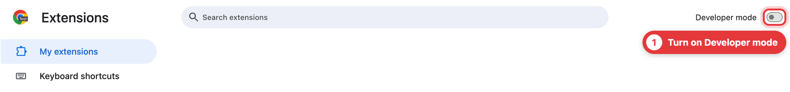
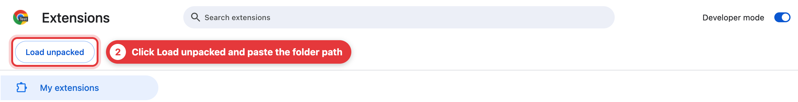
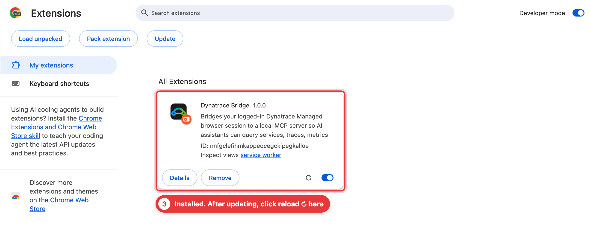
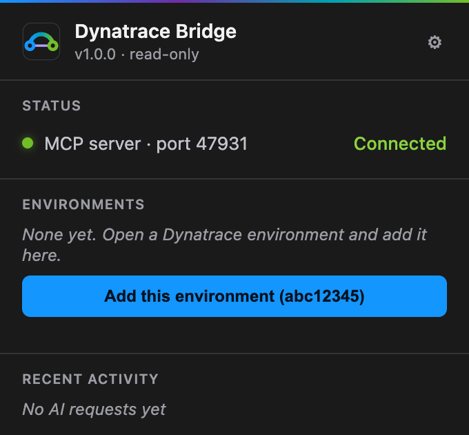
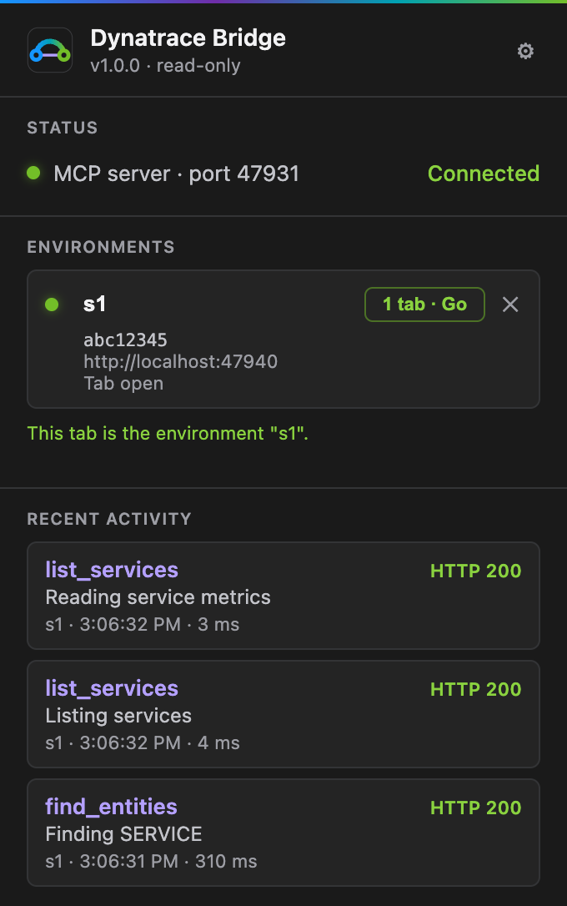
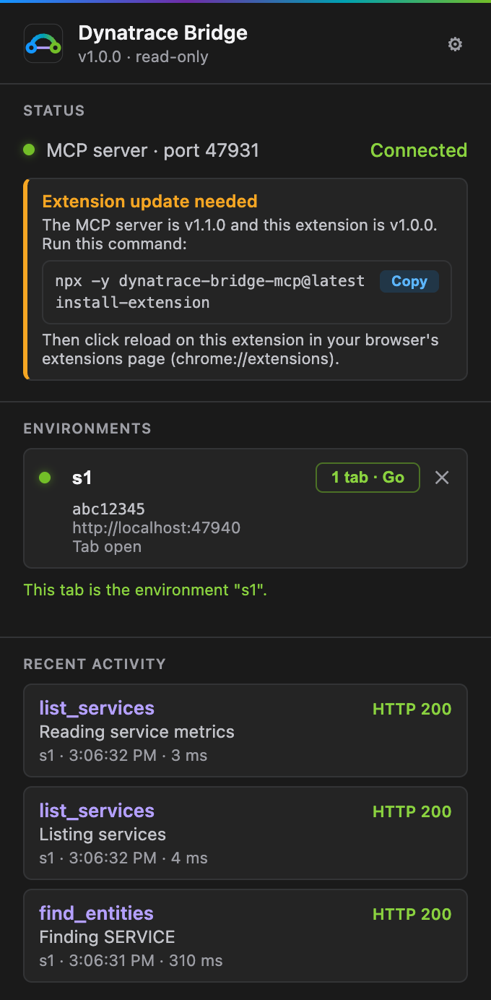

# Dynatrace Bridge MCP

[](https://www.npmjs.com/package/dynatrace-bridge-mcp) [](https://github.com/yunusemregul/dynatrace-bridge-mcp/actions/workflows/ci.yml) [](https://nodejs.org) [](LICENSE)

**English** | [Türkçe](README.tr.md)

**Let your AI assistant query Dynatrace Managed (services, traces, metrics, pods, problems) through your logged-in browser tab. No API tokens, and read-only by construction.**


Dynatrace Managed clusters behind corporate SSO rarely hand out API tokens, and the public API answers `401` without one. Your browser session is the credential you already have. A small extension runs the requests inside your Dynatrace tab, and an MCP server turns the answers into compact text for Claude Code, Cursor, Codex or any other MCP client. The bridge can only send `GET` requests to a fixed list of Dynatrace routes, so it cannot change anything in your environment.


> **Status: early.** The Dynatrace endpoints were explored by hand on one Dynatrace Managed cluster (classic UI, version 1.346). The complete chain (AI client, server, extension, Dynatrace) has so far only been run against a local stand-in page with invented data, which is also where the screenshots on this page come from. It has not yet been run end to end against a real tenant, so expect rough edges and please report them.

## Setup

Takes about two minutes. Using an AI agent with a terminal? [Let it do the setup](#let-your-ai-do-the-setup).

### 1. Add it to your AI client

```bash
claude mcp add --scope user dynatrace-bridge-mcp -- npx -y dynatrace-bridge-mcp@latest
```

`--scope user` makes it available in all your projects (leave it out to add it to the current project only). Your client starts the server by itself whenever it needs it, and `@latest` keeps it up to date.

<details>
<summary>Cursor, Claude Desktop, Codex, Gemini CLI, VS Code, Windows</summary>

JSON config (Claude Desktop, Cursor and most other clients):

```json
{
  "mcpServers": {
    "dynatrace-bridge-mcp": {
      "command": "npx",
      "args": ["-y", "dynatrace-bridge-mcp@latest"]
    }
  }
}
```

Config files: Claude Desktop `~/Library/Application Support/Claude/claude_desktop_config.json` (macOS) or `%APPDATA%\Claude\claude_desktop_config.json` (Windows). Cursor `~/.cursor/mcp.json`.

```bash
codex mcp add dynatrace-bridge-mcp -- npx -y dynatrace-bridge-mcp@latest
gemini mcp add dynatrace-bridge-mcp npx dynatrace-bridge-mcp@latest
code --add-mcp '{"name":"dynatrace-bridge-mcp","command":"npx","args":["-y","dynatrace-bridge-mcp@latest"]}'
```

**Windows:** many clients can't find `npx` on their own, so run it through `cmd /c`. For example `claude mcp add --scope user dynatrace-bridge-mcp -- cmd /c npx -y dynatrace-bridge-mcp@latest`, or `"command": "cmd", "args": ["/c", "npx", "-y", "dynatrace-bridge-mcp@latest"]` in JSON.

**Standalone server:** run `npx -y dynatrace-bridge-mcp@latest` in a terminal and connect clients to `http://localhost:47832/mcp` (or `/sse` for older clients).

**Several clients at once:** the first instance owns the two ports. Every further instance started by another client forwards its tool calls to the first one, so all clients share one browser connection.
</details>

### 2. Install the browser extension

```bash
npx -y dynatrace-bridge-mcp@latest install-extension
```

This copies the extension to `~/.dynatrace-bridge/extension`, puts that path on your clipboard and opens your browser's extensions page. There, turn on **Developer mode**, click **Load unpacked** and paste the path.

Works in Chrome, Edge, Brave, Arc, Vivaldi, Opera and other Chromium browsers (not Firefox or Safari). Install it in the browser where you are logged in to Dynatrace.

<details open>
<summary>Show me with screenshots</summary>





In Edge, Developer mode is in the left sidebar. In the folder picker, press ⌘⇧G on macOS or use the address bar on Windows to paste the path. Add `--browser brave` (or `chrome`, `edge`, `arc`, `vivaldi`, `opera`, `chromium`) to the command to pick a browser other than your default, or `--lang tr|en` to set the output language.
</details>

### 3. Add your environment

Open Dynatrace (a URL that contains `/e/<environment id>/`), log in, click the extension icon and press **Add this environment**. Chrome then asks whether the extension may access that site; allow it. The extension has no access to any site until you add one, and it only ever asks for the Dynatrace origin you are on.

<p align="center">


</p>

The environment gets a short name (the environment id, or its last dash-separated part: `acme-shop-s1` becomes `s1`). Click the name to rename it; the AI selects the environment by this name. Repeat for other environments (stage, prod, …). The first one is the default.

A small pill then appears in the bottom right corner of your Dynatrace tabs. It shows whether the AI is connected and what it is asking for while it works. Click its dot to collapse it.

<p align="center">

</p>

You don't have to keep Dynatrace in front. The bridge uses an open Dynatrace tab in the background, without focusing it. If no tab is open, it opens one in front of you, so that you can log in if Dynatrace asks.

### 4. Try it

> Which services got slower in the last two hours? Pick the worst one and tell me where its time goes.

### Updating

The server updates by itself: `@latest` makes your client start the newest version the next time it starts. When the extension falls behind the server, you are told in three places: the extension popup, the pill in the Dynatrace tab, and a note at the end of the AI's tool results. Re-run the `install-extension` command, then click reload ↻ on **Dynatrace Bridge** in the extensions page.

<p align="center">

</p>

The same places tell you to restart your AI client when the running server is older than the extension, or when a newer release exists on npm.

## Let your AI do the setup

Paste this into Claude Code, Codex, Cursor or any agent with a terminal:

> Set up dynatrace-bridge-mcp for me by following https://github.com/yunusemregul/dynatrace-bridge-mcp#for-ai-agents

### For AI agents

You can run steps 1 and 2. The browser steps need the user, because browsers don't let scripts enable Developer mode, load extensions or grant site access.

1. Check `node --version` is 18 or newer, then register the server with the client you're running in ([commands](#1-add-it-to-your-ai-client); use the `cmd /c` form on Windows).
2. Run `npx -y dynatrace-bridge-mcp@latest install-extension`. It prints the folder path (`--no-open` skips opening the browser, `--no-copy` leaves the clipboard alone, `--browser <name>` picks a browser).
3. Ask the user to turn on **Developer mode**, click **Load unpacked** and paste that path. Wait for them to confirm.
4. Ask the user to open Dynatrace, log in, click the **Dynatrace Bridge** icon (in the puzzle-piece menu if not pinned), press **Add this environment** and allow site access in the browser prompt.
5. Ask the user to restart the client or reconnect MCP servers (`/mcp` in Claude Code) so the tools load.
6. Verify with `curl -s http://localhost:47832/health`. You want `"connected":true` and at least one name in `"environments"`. No answer means the client hasn't started the server yet. Finish with `dynatrace_bridge_status` (pass `check_session: true` to test the login as well).

## What to ask

| Ask | Tools the AI reaches for |
|---|---|
| "Which endpoints are the slowest?" | `trace_statistics` with `request_kind: "web"`, ranked by `P95` or `AVERAGE` |
| "Which endpoints use the most CPU / fail the most?" | `trace_statistics` with `metric: "CPU_TIME"` or `"FAILED_REQUEST_COUNT"` |
| "Why is the checkout service failing?" | `list_services`, `service_overview`, `analyze_failures`, then `list_traces` and `get_trace` |
| "Where does this service spend its time?" | `analyze_response_time`, `service_flow`, `method_hotspots` |
| "Which SQL is slow, and who runs it?" | `top_database_statements`, `statement_callers`, `slow_statement_executions` |
| "Which cron jobs take the longest?" | `cron_job_statistics` |
| "Why does this pod restart? Was it OOM-killed?" | `list_workloads`, `pod_resources`, `pod_events`, `process_runtime` |
| "What happened in problem P-12345?" | `get_problem`, then the service tools for the affected service and window |
| "Show me slow traces of `GET /api/cart`" | `list_traces` with `request` or `url_contains` and `response_time_min_ms`, then `get_trace` and `get_trace_details` |

## Tools

39 tools, listed in the order the server presents them.

**Start here: status, entities, metrics**

| Tool | What it does |
|---|---|
| `dynatrace_bridge_status` | Server and extension versions, connected browsers, configured environments; optionally checks each login. |
| `find_entities` | Finds entities of any type by name or entity selector and returns their ids. |
| `get_entity` | One entity in full: properties, tags, management zones, relationships. |
| `find_metrics` | Searches the metric catalogue for ids, units and dimensions. |
| `query_metrics` | Runs any metric selector and summarises each series (min, avg, max, trend, values over time). |

**Services, events, problems**

| Tool | What it does |
|---|---|
| `list_services` | Services with response time, failure rate and throughput; sortable. |
| `service_overview` | One service: percentiles, failures, throughput, callers and callees, hosts and pods, problems. |
| `list_events` | Deployments, restarts, Kubernetes and anomaly events, identical ones collapsed. |
| `list_problems` | Problems active in the window, filterable by status, impact, severity and entity. |
| `get_problem` | One problem in depth: evidence, root cause findings, impact, trigger event, dependency path. |

**Kubernetes, hosts, processes**

| Tool | What it does |
|---|---|
| `list_workloads` | Workloads with running and desired pods, CPU and memory against requests and limits. |
| `list_pods` | Pods of a workload with phase, node, restarts, requests and limits, containers. |
| `pod_resources` | CPU, throttling, memory, OOM kills and restarts per pod and container over time. |
| `pod_events` | Kubernetes events of a workload's pods: probe failures, kills, scheduling, deploys. |
| `process_runtime` | JVM heap and GC or Node.js heap and event loop metrics of the processes in a pod. |
| `get_host` | One host: hardware, availability, CPU, memory, disks, processes, events. |
| `get_process` | One process or process group: technology, where it runs, services, callers and callees. |

**Traces**

| Tool | What it does |
|---|---|
| `list_service_requests` | Endpoints of a service, SQL statements of a database service, or target hosts of an "unmonitored hosts" service, with metrics. |
| `list_traces` | Single traces of a service or the whole environment, filtered by response time, HTTP code, failure, method, request or URL. |
| `trace_statistics` | Any trace metric split by any dimension (multidimensional analysis), with the same filters. |
| `get_trace` | One trace as a span tree with timings, SQL and downstream calls. |
| `get_trace_details` | One call of a trace: exceptions with stack traces, method tree, SQL text, headers, host or pod. |

**Service analysis, cron jobs, database**

| Tool | What it does |
|---|---|
| `analyze_failures` | Why requests of a service fail: reasons, exceptions, failed downstream calls. |
| `analyze_response_time` | Where the response time goes (code, downstream, database) and how it is distributed. |
| `service_flow` | What a service calls, as a tree with each dependency's contribution. |
| `service_backtrace` | Who calls a service, up to the entry requests and jobs. |
| `top_exceptions` | Exception classes by count, across services or for one. |
| `cron_job_statistics` | Cron jobs by total time, average, longest run, executions and failures. |
| `top_database_statements` | SQL statements of a database service by total time, average, max or executions. |
| `statement_callers` | Which services, requests and jobs execute one SQL statement. |
| `slow_statement_executions` | Slow executions of one statement with the traces they belong to. |

**Profiling**

| Tool | What it does |
|---|---|
| `cpu_by_process_group` | Process groups by CPU time. |
| `method_hotspots` | Hot methods of a service or process group from code-level samples. |
| `thread_analysis` | Thread groups of a process group by state and CPU. |
| `memory_allocation_hotspots` | Where a Java process group allocates memory. |
| `list_process_crashes` | Process crashes in the window. |

**Dashboards and settings**

| Tool | What it does |
|---|---|
| `list_dashboards` | Dashboards visible to you. |
| `get_dashboard` | Tiles of a dashboard and the metric selectors behind its charts. |
| `read_settings` | Reads settings schemas and their values (alerting, anomaly detection, request attributes, …). |

Results are compact text sized for an AI's context: a header stating what was queried and the exact UTC window, tables with the ids the next tool needs, a hint on what to call next, and a link to the matching Dynatrace page. Charts come back as summarised series, not as images.

<details>
<summary>Common parameters</summary>

- **`environment`**: which configured environment to query, by the name shown in the popup. Defaults to the first one.
- **`minutes_lookback`**, **`time_from`**, **`time_to`**: the time window. The default is the last 120 minutes. Timestamps are ISO 8601 and are read as UTC when they carry no zone. `get_problem`, `find_metrics`, `list_dashboards` and `read_settings` have no time window.
- **Entities** (`service`, `workload`, `pod`, `host`, …) can be passed as an id or as a name. An ambiguous name returns the candidates with their ids instead of a guess.
- **Trace filters**, shared by the trace and service analysis tools: `response_time_min_ms`, `response_time_max_ms`, `http_code` (`404`, `4xx`, `400-599`), `failed`, `http_method`, `request`, `url_contains`, `request_kind` (`web` or `database`).
- **`limit`**: how many rows are printed. The output says how many were left out.
</details>

## Troubleshooting

| Problem | Fix |
|---|---|
| The extension icon shows **OFF**, the popup says "Not running" | The MCP server isn't running. It starts with your AI client, so open the client (or reconnect its MCP servers). If you changed `WS_PORT`, set the same port behind the ⚙ in the popup. |
| "No browser extension is connected" | Open the browser where the extension is installed and check that it is enabled and its popup says Connected. |
| "Dynatrace needs a login" and a Dynatrace tab opens in front | Your session expired. Log in to Dynatrace in that tab (the bridge never enters credentials), then ask again. |
| The popup says "The active tab is not a Dynatrace environment page" | The tab's URL must contain `/e/<environment id>/`, which is how Dynatrace Managed addresses an environment. If it does and you are logged in, reload the page and reopen the popup. |
| "No Dynatrace environment is configured" | Open Dynatrace and press **Add this environment** in the popup. |
| "The extension has no site access to …" | Site access was revoked in the browser. Remove the environment in the popup and add it again. |
| "… more data than the bridge relays" (response too large) | The answer exceeded the size limit (32 MiB by default). Ask for a shorter time window or narrower filters. |
| "An extension at chrome-extension://… tried to connect and was refused" | The server only accepts the extension build it ships. Re-run `install-extension`, reload the extension and add the environment again. For a fork or a build with another key, list its origin in `DT_BRIDGE_EXTENSION_ORIGINS`. |
| "Port 47831 (or 47832) is in use by another program" | Free the port or set `WS_PORT` / `MCP_PORT` (see below). |
| "HTTP 403 … lacks the permission" | Your Dynatrace user may not read that data. The bridge has exactly your permissions. |
| "Dynatrace's internal API changed" | A cluster upgrade changed an undocumented endpoint. Please open an issue with the tool name and your cluster version. |

## Configuration

You don't need this for normal use.

<details>
<summary>Environment variables</summary>

Set these in the `env` block of your MCP client config.

| Variable | Default | Purpose |
|---|---|---|
| `MCP_PORT` | `47832` | HTTP port for MCP clients (`/mcp`, `/sse`, `/health`) |
| `WS_PORT` | `47831` | WebSocket port for the extension (also change it behind the ⚙ in the popup) |
| `HOST` | `127.0.0.1` | Bind address of both ports |
| `EXTENSION_WAIT_MS` | `10000` | How long a tool call waits for the extension to connect before it fails |
| `DT_BRIDGE_UPDATE_CHECK` | on | `0` or `false` turns off the daily version check against the npm registry |
| `DT_BRIDGE_UPDATE_URL` | `https://registry.npmjs.org/dynatrace-bridge-mcp/latest` | Where the version check looks, for a registry mirror |
| `DT_BRIDGE_ALLOWED_ORIGINS` | empty | Web origins that may call the HTTP port, comma- or space-separated. Only for a browser-based MCP client |
| `DT_BRIDGE_EXTENSION_ORIGINS` | empty | Extra extension origins that may connect to the WebSocket, e.g. `chrome-extension://<id>` of a fork |
| `DT_BRIDGE_SERVER_VERSION` | version of the package | Overrides the version the server reports to the extension. For trying out the update notices |

Freeing a port: `lsof -ti:47831 | xargs kill` on macOS / Linux, or `netstat -ano | findstr :47831` then `taskkill /PID <pid> /F` on Windows.
</details>

## Security

- **Your session, your permissions.** Requests run inside your Dynatrace tab with your login. The bridge sees what you can see and nothing more. The CSRF token is read in the page for each request and never leaves it; neither it nor your cookies are logged or sent to the server.
- **Read-only by construction.** Only `GET` is possible, there is no way to send a request body, and the path must be one of the exact routes the tools use. Anything else is refused, and paths that contain `apiTokens`, `credentials`, `tokens` or memory dumps are always refused. The rule is enforced three times: in the server before sending, in the extension, and again in the page.
- **Site access only where you grant it.** The extension installs without access to any site and asks for one Dynatrace origin at a time when you add an environment. Removing the last environment of an origin gives the access back.
- **The HTTP port is loopback-only.** It binds to `127.0.0.1`, requires a loopback `Host` header, and refuses any request that carries a browser `Origin` unless you allow that origin, so a web page cannot call it. It has no authentication of its own, so don't expose it to other machines.
- **The WebSocket is pinned to the extension.** The server accepts a connection only from the extension id it ships (`nnfgclefihmkappeocegckipegkalloe`). Web pages and other extensions are refused.
- **Tool output is scrubbed.** Authorization, cookie and CSRF headers are dropped, and token-shaped values and values of secret-looking names are masked before anything reaches the AI.
- **Known limitation.** The extension connects to whatever listens on `localhost:47831`. A local process that takes that port before the server does receives the extension's connection and can send it read-only requests from the allowed list. Closing this would need a pairing secret, which this project does not have.
- **One outbound request.** The server asks the npm registry for the latest version of this package at startup and then once every 24 hours, to tell you about updates. Nothing else leaves your machine besides the requests to your own Dynatrace. Turn it off with `DT_BRIDGE_UPDATE_CHECK=0`.

## Limitations

- **Dynatrace Managed, classic UI.** Environments are recognised by `/e/<environment id>/` in the URL. Dynatrace SaaS with the latest (Grail) UI uses different APIs and is not supported.
- **Verified on version 1.346 only.** Traces, service analysis, database, profiling and the Davis details of a problem come from the internal endpoints behind the Dynatrace UI. They are undocumented and can change with a cluster upgrade; the tools check the response shape and say so when it no longer matches. Entities, metrics, problems, events and the Kubernetes tools use the session mirror of the documented API v2 and are less exposed to that.
- **No logs.** There are no log tools. The environment this was built against does not grant log access to UI users, so nothing could be built or checked.
- **Sampling and retention apply.** Dynatrace keeps and samples traces as configured on your cluster; the tools pass on the warnings Dynatrace attaches.
- **Mind your operator.** The bridge uses your UI session against endpoints meant for the UI. It runs analysis requests one at a time per environment, but whether this use is welcome on your cluster is for you and its operator to decide.
- **Not an official Dynatrace product.** This project is not affiliated with or endorsed by Dynatrace.

## Development

```bash
git clone https://github.com/yunusemregul/dynatrace-bridge-mcp.git
cd dynatrace-bridge-mcp
npm install
npm run verify
```

`npm run verify` is the build check, and the only one: there is no test suite. It checks syntax, the version sync between `package.json` and the extension manifest, the pinned extension id, the translations, that the server-side and extension-side allow-lists agree on every case, the installer, and a real server start with its HTTP and WebSocket gates. It never opens a browser and never contacts Dynatrace. CI runs it on every push to `main` and on every pull request.

Plain JavaScript (ESM), Node 18 or newer, no build step. To work on the extension, load the repository's `extension/` folder with **Load unpacked**. [ARCHITECTURE.md](ARCHITECTURE.md) describes the protocol, the allow-list and how to write a tool.

## License

[MIT](LICENSE)
