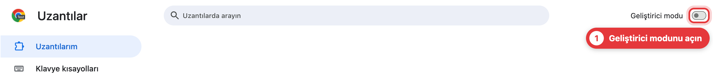
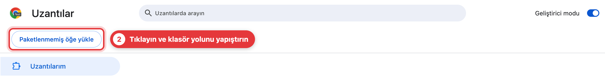
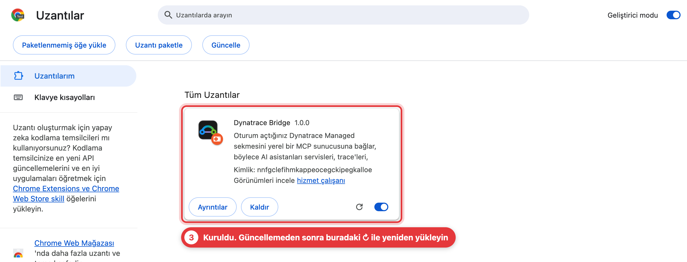
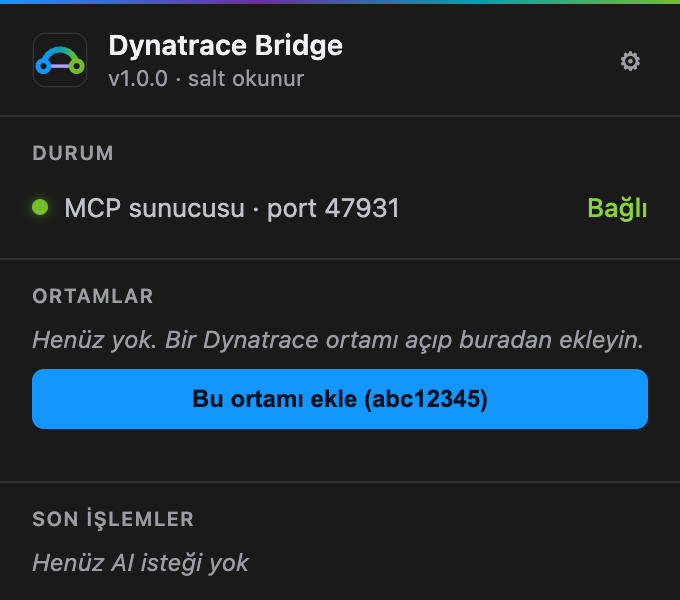
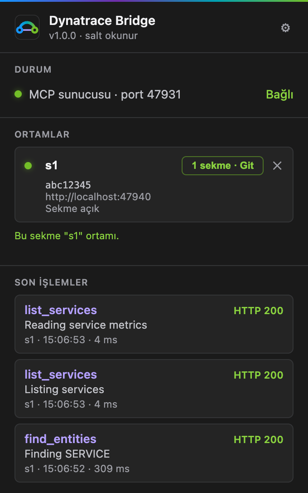
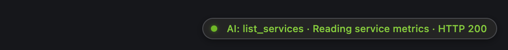
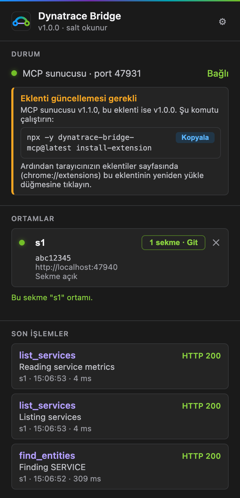

# Dynatrace Bridge MCP

[](https://www.npmjs.com/package/dynatrace-bridge-mcp) [](https://github.com/yunusemregul/dynatrace-bridge-mcp/actions/workflows/ci.yml) [](https://nodejs.org) [](LICENSE)

[English](README.md) | **Türkçe**

**AI asistanınız Dynatrace Managed'ı (servisler, trace'ler, metrikler, pod'lar, problemler) giriş yaptığınız tarayıcı sekmesi üzerinden sorgulasın. API token'ı yok, üstelik yapısı gereği salt okunur.**


Kurumsal SSO arkasındaki Dynatrace Managed kurulumları nadiren API token verir, herkese açık API de token olmadan `401` döner. Tarayıcı oturumunuz ise zaten elinizde olan kimlik bilgisidir. Küçük bir uzantı istekleri Dynatrace sekmenizin içinde çalıştırır, MCP sunucusu da yanıtları Claude Code, Cursor, Codex veya başka bir MCP istemcisi için derli toplu metne çevirir. Köprü yalnızca sabit bir Dynatrace adres listesine `GET` isteği gönderebilir, yani ortamınızda hiçbir şeyi değiştiremez.


> **Durum: erken aşama.** Dynatrace uç noktaları tek bir Dynatrace Managed kurulumunda (klasik arayüz, sürüm 1.346) elle incelendi. Zincirin tamamı (AI istemcisi, sunucu, uzantı, Dynatrace) şimdiye kadar yalnızca uydurma verilerle çalışan yerel bir temsili sayfaya karşı çalıştırıldı; bu sayfadaki ekran görüntüleri de oradan alındı. Gerçek bir ortamda henüz uçtan uca çalıştırılmadı. Pürüz çıkabilir; karşılaşırsanız lütfen bildirin.

## Kurulum

Yaklaşık iki dakika sürer. Terminali olan bir AI ajanı mı kullanıyorsunuz? [Kurulumu ona bırakın](#kurulumu-ai-yapsın).

### 1. AI istemcinize ekleyin

```bash
claude mcp add --scope user dynatrace-bridge-mcp -- npx -y dynatrace-bridge-mcp@latest
```

`--scope user` sunucuyu tüm projelerinizde kullanılabilir yapar (yalnızca mevcut projeye eklemek için bu kısmı çıkarın). İstemciniz sunucuya ihtiyaç duyduğunda onu kendisi başlatır. `@latest` sayesinde de hep güncel kalır.

<details>
<summary>Cursor, Claude Desktop, Codex, Gemini CLI, VS Code, Windows</summary>

JSON yapılandırması (Claude Desktop, Cursor ve diğer çoğu istemci):

```json
{
  "mcpServers": {
    "dynatrace-bridge-mcp": {
      "command": "npx",
      "args": ["-y", "dynatrace-bridge-mcp@latest"]
    }
  }
}
```

Yapılandırma dosyaları: Claude Desktop için `~/Library/Application Support/Claude/claude_desktop_config.json` (macOS) veya `%APPDATA%\Claude\claude_desktop_config.json` (Windows). Cursor için `~/.cursor/mcp.json`.

```bash
codex mcp add dynatrace-bridge-mcp -- npx -y dynatrace-bridge-mcp@latest
gemini mcp add dynatrace-bridge-mcp npx dynatrace-bridge-mcp@latest
code --add-mcp '{"name":"dynatrace-bridge-mcp","command":"npx","args":["-y","dynatrace-bridge-mcp@latest"]}'
```

**Windows:** birçok istemci `npx`'i kendi başına bulamaz, bu yüzden `cmd /c` üzerinden çalıştırın. Örneğin `claude mcp add --scope user dynatrace-bridge-mcp -- cmd /c npx -y dynatrace-bridge-mcp@latest` ya da JSON'da `"command": "cmd", "args": ["/c", "npx", "-y", "dynatrace-bridge-mcp@latest"]`.

**Bağımsız sunucu:** terminalde `npx -y dynatrace-bridge-mcp@latest` çalıştırın ve istemcileri `http://localhost:47832/mcp` adresine bağlayın (eski istemciler için `/sse`).

**Aynı anda birden fazla istemci:** iki portu ilk başlayan sunucu alır. Başka bir istemcinin başlattığı sonraki her sunucu, araç çağrılarını ilkine iletir. Böylece bütün istemciler tek bir tarayıcı bağlantısını paylaşır.
</details>

### 2. Tarayıcı uzantısını kurun

```bash
npx -y dynatrace-bridge-mcp@latest install-extension
```

Bu komut uzantıyı `~/.dynatrace-bridge/extension` klasörüne kopyalar, klasörün yolunu panoya alır ve tarayıcınızın Uzantılar sayfasını açar. Orada **Geliştirici modu** seçeneğini açın, **Paketlenmemiş öğe yükle** düğmesine tıklayın ve yolu yapıştırın.

Chrome, Edge, Brave, Arc, Vivaldi, Opera ve diğer Chromium tabanlı tarayıcılarda çalışır (Firefox ve Safari desteklenmez). Dynatrace'e hangi tarayıcıda giriş yapıyorsanız oraya kurun.

<details open>
<summary>Ekran görüntüleriyle göster</summary>





Edge'de Geliştirici modu sol kenar çubuğundadır. Klasör seçicide yolu yapıştırmak için macOS'ta ⌘⇧G tuşlarına basın, Windows'ta adres çubuğunu kullanın. Varsayılan tarayıcınız dışında birini seçmek için komuta `--browser brave` (veya `chrome`, `edge`, `arc`, `vivaldi`, `opera`, `chromium`) ekleyin. Çıktı dilini `--lang tr|en` ile belirleyebilirsiniz.
</details>

### 3. Ortamınızı ekleyin

Dynatrace'i açın (adresinde `/e/<ortam kimliği>/` bulunan bir sayfa), giriş yapın, uzantı simgesine tıklayın ve **Bu ortamı ekle** düğmesine basın. Chrome, uzantının bu siteye erişip erişemeyeceğini sorar; izin verin. Siz bir ortam ekleyene kadar uzantının hiçbir siteye erişimi yoktur ve yalnızca o an bulunduğunuz Dynatrace adresi için izin ister.

<p align="center">


</p>

Ortama kısa bir ad verilir (ortam kimliği ya da kimliğin tireyle ayrılmış son parçası: `acme-shop-s1` için `s1`). Adı değiştirmek için üzerine tıklayın; AI ortamı bu adla seçer. Diğer ortamlar (stage, prod, …) için de aynısını yapın. İlk eklenen ortam varsayılandır.

Ardından Dynatrace sekmelerinizin sağ alt köşesinde küçük bir etiket belirir. AI'ın bağlı olup olmadığını ve çalışırken ne istediğini gösterir. Küçültmek için noktasına tıklayın.

<p align="center">

</p>

Dynatrace'i önde tutmanız gerekmez. Köprü, açık bir Dynatrace sekmesini arka planda, öne getirmeden kullanır. Açık sekme yoksa önünüze bir sekme açar; böylece Dynatrace giriş isterse giriş yapabilirsiniz.

### 4. Deneyin

> Son iki saatte hangi servisler yavaşladı? En kötüsünü seç ve zamanının nereye gittiğini anlat.

### Güncelleme

Sunucu kendini günceller: `@latest` sayesinde istemciniz bir sonraki açılışında en yeni sürümü başlatır. Uzantı sunucunun gerisinde kaldığında bunu üç yerde görürsünüz: uzantı penceresinde, Dynatrace sekmesindeki etikette ve AI'ın araç sonuçlarının sonundaki notta. `install-extension` komutunu yeniden çalıştırın, ardından Uzantılar sayfasında **Dynatrace Bridge** üzerindeki yeniden yükle ↻ simgesine tıklayın.

<p align="center">

</p>

Çalışan sunucu uzantıdan eskiyse ya da npm'de daha yeni bir sürüm varsa, aynı yerlerde AI istemcinizi yeniden başlatmanız söylenir.

## Kurulumu AI yapsın

Bunu Claude Code, Codex, Cursor veya terminali olan herhangi bir ajana yapıştırın:

> https://github.com/yunusemregul/dynatrace-bridge-mcp/blob/main/README.tr.md#for-ai-agents adresindeki adımları izleyerek dynatrace-bridge-mcp'yi benim için kur.

<a id="for-ai-agents"></a>
### AI ajanları için

Adım 1 ve 2'yi sen çalıştırabilirsin. Tarayıcı adımları kullanıcıyı gerektirir, çünkü tarayıcılar betiklerin Geliştirici modunu açmasına, uzantı yüklemesine veya site erişimi vermesine izin vermez.

1. `node --version` değerinin 18 veya üzeri olduğunu kontrol et, ardından sunucuyu içinde çalıştığın istemciye kaydet ([komutlar](#1-ai-istemcinize-ekleyin); Windows'ta `cmd /c` biçimini kullan).
2. `npx -y dynatrace-bridge-mcp@latest install-extension` komutunu çalıştır. Klasör yolunu yazdırır (`--no-open` tarayıcıyı açmaz, `--no-copy` panoya dokunmaz, `--browser <ad>` tarayıcı seçer).
3. Kullanıcıdan **Geliştirici modu** seçeneğini açmasını, **Paketlenmemiş öğe yükle** düğmesine tıklamasını ve o yolu yapıştırmasını iste. Onaylamasını bekle.
4. Kullanıcıdan Dynatrace'i açıp giriş yapmasını, **Dynatrace Bridge** simgesine tıklamasını (sabitlenmemişse yapboz parçası menüsündedir), **Bu ortamı ekle** düğmesine basmasını ve tarayıcının sorduğu site erişimine izin vermesini iste.
5. Araçların yüklenmesi için kullanıcıdan istemciyi yeniden başlatmasını veya MCP sunucularına yeniden bağlanmasını iste (Claude Code'da `/mcp`).
6. `curl -s http://localhost:47832/health` ile doğrula. `"connected":true` ve `"environments"` içinde en az bir ad görmelisin. Yanıt yoksa istemci sunucuyu henüz başlatmamıştır. Son olarak `dynatrace_bridge_status` çağır (oturumu da sınamak için `check_session: true` ver).

## Neler sorabilirsiniz

| Soru | AI'ın başvurduğu araçlar |
|---|---|
| "En yavaş endpoint'ler hangileri?" | `request_kind: "web"` ile `trace_statistics`, `P95` veya `AVERAGE` sıralamasıyla |
| "En çok CPU harcayan / en çok hata veren endpoint'ler hangileri?" | `metric: "CPU_TIME"` veya `"FAILED_REQUEST_COUNT"` ile `trace_statistics` |
| "Checkout servisi neden hata veriyor?" | `list_services`, `service_overview`, `analyze_failures`, ardından `list_traces` ve `get_trace` |
| "Bu servis zamanını nerede harcıyor?" | `analyze_response_time`, `service_flow`, `method_hotspots` |
| "Hangi SQL yavaş ve onu kim çalıştırıyor?" | `top_database_statements`, `statement_callers`, `slow_statement_executions` |
| "En uzun süren cron job'lar hangileri?" | `cron_job_statistics` |
| "Bu pod neden yeniden başlıyor? OOM yüzünden mi öldürüldü?" | `list_workloads`, `pod_resources`, `pod_events`, `process_runtime` |
| "P-12345 probleminde ne oldu?" | `get_problem`, ardından etkilenen servis ve zaman aralığı için servis araçları |
| "`GET /api/cart` için yavaş trace'leri göster" | `request` veya `url_contains` ve `response_time_min_ms` ile `list_traces`, ardından `get_trace` ve `get_trace_details` |

## Araçlar

39 araç, sunucunun sunduğu sırayla.

**Başlangıç: durum, varlıklar, metrikler**

| Araç | Ne yapar |
|---|---|
| `dynatrace_bridge_status` | Sunucu ve uzantı sürümleri, bağlı tarayıcılar, tanımlı ortamlar; istenirse her ortamın oturumunu da sınar. |
| `find_entities` | Her tipten varlığı ada veya varlık seçicisine göre bulur, kimliklerini döner. |
| `get_entity` | Tek bir varlığın tamamı: özellikler, etiketler, yönetim bölgeleri, ilişkiler. |
| `find_metrics` | Metrik kataloğunda kimlik, birim ve boyut arar. |
| `query_metrics` | Herhangi bir metrik seçicisini çalıştırır, her seriyi özetler (min, ortalama, maks, eğilim, zamana göre değerler). |

**Servisler, olaylar, problemler**

| Araç | Ne yapar |
|---|---|
| `list_services` | Servisler; yanıt süresi, hata oranı ve işlem hacmiyle, sıralanabilir. |
| `service_overview` | Tek servis: yüzdelikler, hatalar, işlem hacmi, çağıranlar ve çağrılanlar, host ve pod'lar, problemler. |
| `list_events` | Deployment'lar, yeniden başlatmalar, Kubernetes ve anomali olayları; aynı olaylar tek satırda toplanır. |
| `list_problems` | Zaman aralığında etkin problemler; durum, etki, önem ve varlığa göre süzülebilir. |
| `get_problem` | Tek problemin ayrıntısı: kanıtlar, kök neden bulguları, etki, tetikleyen olay, bağımlılık yolu. |

**Kubernetes, host'lar, process'ler**

| Araç | Ne yapar |
|---|---|
| `list_workloads` | Workload'lar; çalışan ve istenen pod sayısı, request ve limit'lere göre CPU ve bellek kullanımı. |
| `list_pods` | Bir workload'un pod'ları; durum, node, yeniden başlatma sayısı, request ve limit'ler, container'lar. |
| `pod_resources` | Pod ve container başına zaman içinde CPU, throttling, bellek, OOM kill ve yeniden başlatmalar. |
| `pod_events` | Bir workload'un pod'larına ait Kubernetes olayları: probe hataları, kill'ler, zamanlama, deploy'lar. |
| `process_runtime` | Bir pod'daki process'lerin JVM heap ve GC ya da Node.js heap ve event loop metrikleri. |
| `get_host` | Tek host: donanım, erişilebilirlik, CPU, bellek, diskler, process'ler, olaylar. |
| `get_process` | Tek process veya process grubu: teknoloji, nerede çalıştığı, servisleri, çağıranlar ve çağrılanlar. |

**Trace'ler**

| Araç | Ne yapar |
|---|---|
| `list_service_requests` | Bir servisin endpoint'leri, bir veritabanı servisinin SQL ifadeleri ya da "izlenmeyen host'lar" servisinin hedef host'ları, metrikleriyle. |
| `list_traces` | Bir servisin veya tüm ortamın tekil trace'leri; yanıt süresi, HTTP kodu, hata, metot, istek veya URL'ye göre süzülür. |
| `trace_statistics` | Herhangi bir trace metriğini herhangi bir boyuta göre kırar (çok boyutlu analiz), aynı filtrelerle. |
| `get_trace` | Tek trace; süreler, SQL ve alt çağrılarla birlikte span ağacı olarak. |
| `get_trace_details` | Bir trace'in tek çağrısı: stack trace'leriyle exception'lar, metot ağacı, SQL metni, header'lar, host veya pod. |

**Servis analizi, cron job'lar, veritabanı**

| Araç | Ne yapar |
|---|---|
| `analyze_failures` | Bir servisin istekleri neden hata veriyor: nedenler, exception'lar, hata veren alt çağrılar. |
| `analyze_response_time` | Yanıt süresi nereye gidiyor (kod, alt servisler, veritabanı) ve nasıl dağılıyor. |
| `service_flow` | Bir servisin çağırdıkları; her bağımlılığın katkısıyla birlikte ağaç olarak. |
| `service_backtrace` | Bir servisi kimler çağırıyor; giriş isteklerine ve job'lara kadar. |
| `top_exceptions` | Sayıya göre exception sınıfları; tüm servislerde veya tek serviste. |
| `cron_job_statistics` | Cron job'lar; toplam süre, ortalama, en uzun çalışma, çalışma sayısı ve hatalara göre. |
| `top_database_statements` | Bir veritabanı servisinin SQL ifadeleri; toplam süre, ortalama, maksimum veya çalışma sayısına göre. |
| `statement_callers` | Bir SQL ifadesini hangi servisler, istekler ve job'lar çalıştırıyor. |
| `slow_statement_executions` | Bir ifadenin yavaş çalışmaları, ait oldukları trace'lerle. |

**Profiling**

| Araç | Ne yapar |
|---|---|
| `cpu_by_process_group` | CPU süresine göre process grupları. |
| `method_hotspots` | Kod düzeyi örneklerden bir servisin veya process grubunun en çok zaman harcadığı metotlar. |
| `thread_analysis` | Bir process grubunun thread grupları; duruma ve CPU'ya göre. |
| `memory_allocation_hotspots` | Bir Java process grubu belleği nerede ayırıyor. |
| `list_process_crashes` | Zaman aralığındaki process çökmeleri. |

**Dashboard'lar ve ayarlar**

| Araç | Ne yapar |
|---|---|
| `list_dashboards` | Görebildiğiniz dashboard'lar. |
| `get_dashboard` | Bir dashboard'un kutucukları ve grafiklerinin arkasındaki metrik seçicileri. |
| `read_settings` | Ayar şemalarını ve değerlerini okur (uyarılar, anomali tespiti, request attribute'ları, …). |

Sonuçlar, bir AI'ın bağlamına sığacak derli toplu metinlerdir: neyin sorgulandığını ve kesin UTC aralığını belirten bir başlık, sonraki aracın ihtiyaç duyduğu kimlikleri içeren tablolar, sırada neyin çağrılacağına dair bir ipucu ve ilgili Dynatrace sayfasının bağlantısı. Grafikler görsel olarak değil, özetlenmiş seriler olarak döner.

<details>
<summary>Sık kullanılan parametreler</summary>

- **`environment`**: hangi tanımlı ortamın sorgulanacağı; uzantı penceresinde görünen adla. Varsayılan ilk ortamdır.
- **`minutes_lookback`**, **`time_from`**, **`time_to`**: zaman aralığı. Varsayılan son 120 dakikadır. Zaman damgaları ISO 8601 biçimindedir; saat dilimi belirtilmemişse UTC kabul edilir. `get_problem`, `find_metrics`, `list_dashboards` ve `read_settings` zaman aralığı almaz.
- **Varlıklar** (`service`, `workload`, `pod`, `host`, …) kimlikle veya adla verilebilir. Birden fazla varlıkla eşleşen bir ad için tahmin yürütülmez; adaylar kimlikleriyle listelenir.
- **Trace filtreleri**, trace ve servis analizi araçlarında ortaktır: `response_time_min_ms`, `response_time_max_ms`, `http_code` (`404`, `4xx`, `400-599`), `failed`, `http_method`, `request`, `url_contains`, `request_kind` (`web` veya `database`).
- **`limit`**: kaç satır yazdırılacağı. Çıktı, kaç satırın dışarıda kaldığını belirtir.
</details>

## Sorun giderme

| Sorun | Çözüm |
|---|---|
| Uzantı simgesinde **OFF** yazıyor, pencerede "Çalışmıyor" görünüyor | MCP sunucusu çalışmıyor. Sunucu AI istemcinizle birlikte başlar; istemciyi açın (veya MCP sunucularına yeniden bağlanın). `WS_PORT` değerini değiştirdiyseniz aynı portu penceredeki ⚙ altında da ayarlayın. |
| "No browser extension is connected" | Uzantının kurulu olduğu tarayıcıyı açın; uzantının etkin olduğunu ve penceresinde Bağlı yazdığını kontrol edin. |
| "Dynatrace needs a login" ve önünüzde bir Dynatrace sekmesi açılıyor | Oturumunuzun süresi dolmuş. O sekmede Dynatrace'e giriş yapın (köprü hiçbir zaman kimlik bilgisi girmez), sonra tekrar sorun. |
| Pencerede "Etkin sekme bir Dynatrace ortam sayfası değil" yazıyor | Sekmenin adresinde `/e/<ortam kimliği>/` bulunmalı; Dynatrace Managed bir ortamı böyle adresler. Adres doğruysa ve giriş yaptıysanız sayfayı yenileyip pencereyi yeniden açın. |
| "No Dynatrace environment is configured" | Dynatrace'i açın ve uzantı penceresinde **Bu ortamı ekle** düğmesine basın. |
| "The extension has no site access to …" | Site erişimi tarayıcıda kaldırılmış. Ortamı pencereden silip yeniden ekleyin. |
| "… more data than the bridge relays" (yanıt çok büyük) | Yanıt boyut sınırını aştı (varsayılan 32 MiB). Daha kısa bir zaman aralığı veya daha dar filtreler isteyin. |
| "An extension at chrome-extension://… tried to connect and was refused" | Sunucu yalnızca kendi dağıttığı uzantı sürümünü kabul eder. `install-extension` komutunu yeniden çalıştırın, uzantıyı yeniden yükleyin ve ortamı tekrar ekleyin. Bir fork ya da başka anahtarla derlenmiş bir sürüm için adresini `DT_BRIDGE_EXTENSION_ORIGINS` değişkenine yazın. |
| "Port 47831 (or 47832) is in use by another program" | Portu boşaltın veya `WS_PORT` / `MCP_PORT` ayarlayın (aşağıya bakın). |
| "HTTP 403 … lacks the permission" | Dynatrace kullanıcınızın o veriyi okuma yetkisi yok. Köprünün yetkileri sizinkilerle birebir aynıdır. |
| "Dynatrace's internal API changed" | Bir sürüm yükseltmesi belgelenmemiş bir uç noktayı değiştirmiş. Lütfen araç adını ve Dynatrace sürümünüzü yazarak bir issue açın. |

## Yapılandırma

Normal kullanımda buna ihtiyacınız yok.

<details>
<summary>Ortam değişkenleri</summary>

Bunları MCP istemci yapılandırmanızın `env` bloğunda ayarlayın.

| Değişken | Varsayılan | Amaç |
|---|---|---|
| `MCP_PORT` | `47832` | MCP istemcileri için HTTP portu (`/mcp`, `/sse`, `/health`) |
| `WS_PORT` | `47831` | Uzantı için WebSocket portu (penceredeki ⚙ altında da değiştirin) |
| `HOST` | `127.0.0.1` | İki portun dinlediği adres |
| `EXTENSION_WAIT_MS` | `10000` | Bir araç çağrısının, hata vermeden önce uzantının bağlanmasını ne kadar beklediği |
| `DT_BRIDGE_UPDATE_CHECK` | açık | `0` veya `false`, npm kayıt defterine yapılan günlük sürüm kontrolünü kapatır |
| `DT_BRIDGE_UPDATE_URL` | `https://registry.npmjs.org/dynatrace-bridge-mcp/latest` | Sürüm kontrolünün baktığı adres; bir kayıt defteri aynası için |
| `DT_BRIDGE_ALLOWED_ORIGINS` | boş | HTTP portunu çağırabilecek web origin'leri, virgül veya boşlukla ayrılmış. Yalnızca tarayıcı tabanlı bir MCP istemcisi için |
| `DT_BRIDGE_EXTENSION_ORIGINS` | boş | WebSocket'e bağlanabilecek ek uzantı origin'leri, ör. bir fork'un `chrome-extension://<kimlik>` adresi |
| `DT_BRIDGE_SERVER_VERSION` | paketin sürümü | Sunucunun uzantıya bildirdiği sürümü değiştirir. Güncelleme uyarılarını denemek için |

Port boşaltma: macOS / Linux'ta `lsof -ti:47831 | xargs kill`, Windows'ta `netstat -ano | findstr :47831` ardından `taskkill /PID <pid> /F`.
</details>

## Güvenlik

- **Sizin oturumunuz, sizin yetkileriniz.** İstekler Dynatrace sekmenizin içinde, sizin oturumunuzla çalışır. Köprü sizin görebildiğinizi görür, fazlasını değil. CSRF token'ı her istekte sayfanın içinde okunur ve sayfadan dışarı çıkmaz; ne o ne de çerezleriniz loglanır veya sunucuya gönderilir.
- **Yapısı gereği salt okunur.** Yalnızca `GET` mümkündür, istek gövdesi göndermenin bir yolu yoktur ve adres, araçların kullandığı belirli adreslerden biri olmak zorundadır. Geri kalan her şey reddedilir; içinde `apiTokens`, `credentials`, `tokens` veya bellek dökümü geçen adresler her zaman reddedilir. Kural üç yerde uygulanır: göndermeden önce sunucuda, uzantıda ve bir kez daha sayfanın içinde.
- **Site erişimi yalnızca sizin verdiğiniz yerde.** Uzantı hiçbir siteye erişimi olmadan kurulur ve bir ortam eklediğinizde yalnızca o Dynatrace adresi için izin ister. Bir adresin son ortamını kaldırdığınızda erişimi de geri verir.
- **HTTP portu yalnızca yerel makineye açıktır.** `127.0.0.1` adresini dinler, yerel bir `Host` başlığı ister ve tarayıcıdan gelen `Origin` başlıklı istekleri, o origin'e siz izin vermedikçe reddeder; yani bir web sayfası bu portu çağıramaz. Kendi kimlik doğrulaması yoktur, bu yüzden başka makinelere açmayın.
- **WebSocket uzantıya sabitlenmiştir.** Sunucu yalnızca kendi dağıttığı uzantı kimliğinden (`nnfgclefihmkappeocegckipegkalloe`) gelen bağlantıyı kabul eder. Web sayfaları ve başka uzantılar reddedilir.
- **Araç çıktıları temizlenir.** Authorization, cookie ve CSRF header'ları atılır; token'a benzeyen değerler ve adı gizli bilgi çağrıştıran alanların değerleri AI'a ulaşmadan önce maskelenir.
- **Bilinen sınır.** Uzantı, `localhost:47831` üzerinde kim dinliyorsa ona bağlanır. Bu portu sunucudan önce alan yerel bir program uzantının bağlantısını devralır ve ona izinli listedeki salt okunur istekleri gönderebilir. Bunu kapatmak için bir eşleştirme anahtarı gerekir; bu projede yoktur.
- **Dışarıya giden tek istek.** Sunucu, güncellemeleri haber verebilmek için açılışta ve ardından 24 saatte bir npm kayıt defterine bu paketin son sürümünü sorar. Kendi Dynatrace'inize giden istekler dışında bilgisayarınızdan başka hiçbir şey çıkmaz. Kapatmak için `DT_BRIDGE_UPDATE_CHECK=0`.

## Sınırlar

- **Dynatrace Managed, klasik arayüz.** Ortamlar adresteki `/e/<ortam kimliği>/` kısmından tanınır. En yeni (Grail) arayüzlü Dynatrace SaaS farklı API'ler kullanır ve desteklenmez.
- **Yalnızca 1.346 sürümünde doğrulandı.** Trace'ler, servis analizi, veritabanı, profiling ve bir problemin Davis ayrıntıları Dynatrace arayüzünün arkasındaki dahili uç noktalardan gelir. Bunlar belgelenmemiştir ve bir sürüm yükseltmesiyle değişebilir; araçlar yanıtın biçimini kontrol eder ve uymadığında bunu açıkça söyler. Varlıklar, metrikler, problemler, olaylar ve Kubernetes araçları, belgelenmiş API v2'nin oturumla erişilen kopyasını kullanır ve bundan daha az etkilenir.
- **Log yok.** Log aracı bulunmuyor. Bu projenin geliştirildiği ortam, arayüz kullanıcılarına log erişimi vermediği için ne geliştirilebildi ne de denenebildi.
- **Örnekleme ve saklama süresi geçerlidir.** Dynatrace trace'leri kurulumunuzdaki ayarlara göre saklar ve örnekler; araçlar Dynatrace'in eklediği uyarıları olduğu gibi aktarır.
- **Kurulumun sahibine danışın.** Köprü, arayüz oturumunuzu arayüz için tasarlanmış uç noktalara karşı kullanır. Analiz isteklerini ortam başına teker teker gönderir; yine de bu kullanımın uygun olup olmadığına siz ve kurulumu işleten ekip karar verirsiniz.
- **Resmî bir Dynatrace ürünü değildir.** Bu projenin Dynatrace ile bir bağı yoktur ve Dynatrace tarafından desteklenmez.

## Geliştirme

```bash
git clone https://github.com/yunusemregul/dynatrace-bridge-mcp.git
cd dynatrace-bridge-mcp
npm install
npm run verify
```

`npm run verify` derleme kontrolüdür ve tek kontrol odur: test paketi yoktur. Sözdizimini, `package.json` ile uzantı manifest'i arasındaki sürüm eşitliğini, sabitlenmiş uzantı kimliğini, çevirileri, sunucu ve uzantı tarafındaki izin listelerinin her durumda aynı kararı verdiğini, kurulum komutunu ve HTTP ile WebSocket kapılarıyla birlikte gerçek bir sunucu açılışını denetler. Hiçbir zaman tarayıcı açmaz ve Dynatrace'e bağlanmaz. CI bunu `main` dalına yapılan her push'ta ve her pull request'te çalıştırır.

Düz JavaScript (ESM), Node 18 veya üzeri, derleme adımı yok. Uzantı üzerinde çalışmak için depodaki `extension/` klasörünü **Paketlenmemiş öğe yükle** ile yükleyin. Protokol, izin listesi ve araç yazımı [ARCHITECTURE.md](ARCHITECTURE.md) dosyasında anlatılır (İngilizce).

## Lisans

[MIT](LICENSE)
